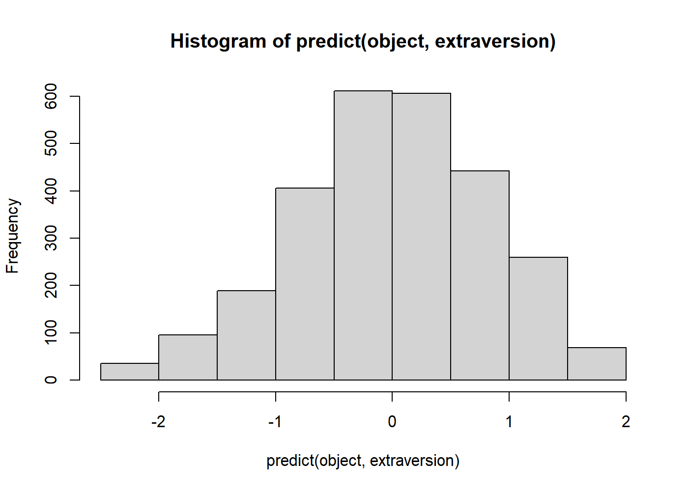

<!-- README.md is generated from README.Rmd. Please edit that file -->

# conogive 

[](https://travis-ci.com/JonasMoss/conogive)
[](https://ci.appveyor.com/project/JonasMoss/conogive)
[](https://www.repostatus.org/#wip)
[](https://codecov.io/gh/JonasMoss/conogive?branch=master)

<!--[](https://www.repostatus.org/#active)-->

An `R` package for the congeneric ogive model.

## Overview

The congeneric ogive model is a psychometric model for Likert scale data
with one latent factor. This package has functions to estimate such
models, calculate their ordinal reliabilities, and make predictions.

## Installation

From inside `R`, use one of the following commands:

``` r
devtools::install_github("JonasMoss/conogive")
```

## Usage

Estimate a congeneric ogive model with `congive`, predict the value of
the latent factor with `predict`, and calculate the reliability with
`ordinal_omega`.

``` r
library("conogive")
extraversion = psychTools::bfi[c("E1", "E2", "E3", "E4", "E5")]
extraversion[, "E1"] = 7 - extraversion[, "E1"] # Reverse-coded item.
extraversion[, "E2"] = 7 - extraversion[, "E2"] # Reverse-coded item.

object = conogive(extraversion)

ordinal_omega(object) # Observed reliability
#> [1] 0.7046056
omega(object) # Theoretical reliability
#> [1] 0.8122608

hist(predict(object, extraversion)) # Plot distribution of predictions.
```


